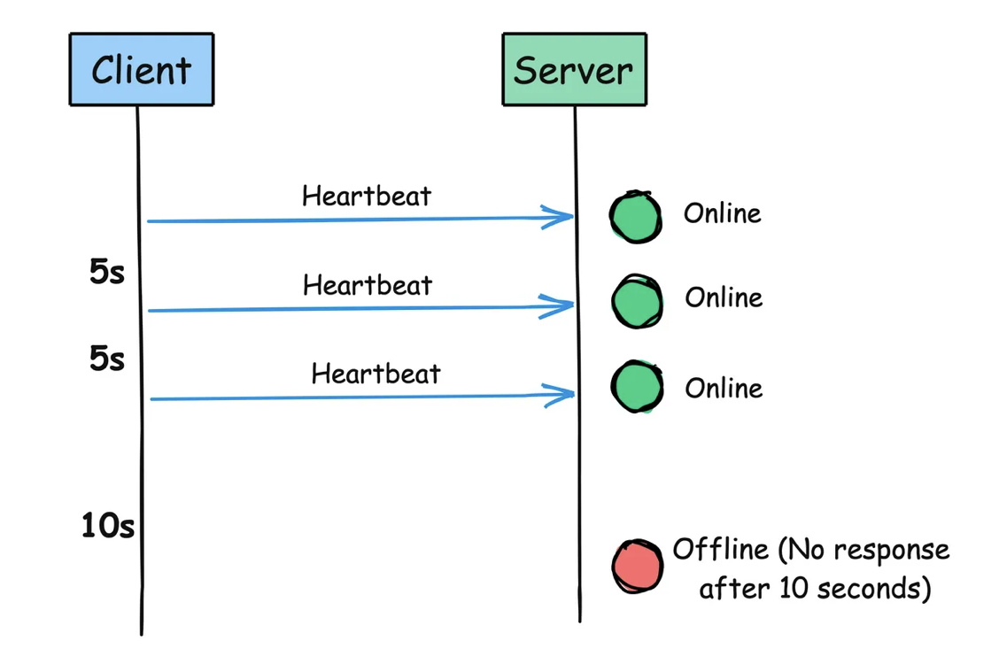

# Dockerizar Aplicación

### Requisitos

* Node
* NPM
* Docker

### Crear aplicación NestJS

Para crear la aplicación usaremos Nest CLI

```bash
npm i -g @nestjs/cli 
&& nest new nest-docker 
&& cd nest-docker 
&& npm i
```

En el terminal usaremos:

```bash
npm start
```

La aplicación debería empezar a correr en el puerto <mark style="color:purple;">**3000**</mark>, este puerto se puede configurar en el archivo `main.ts` ubicado en `/src` del proyecto.

### Archivo Docker

Debemos crear un archivo llamado `Dockerfile` en nuestra raiz del proyecto, que tenga el siguiente contenido:

```docker
# Versión de node que se va acupar en el contenedor
FROM node:18 

# Crear directorio de aplicaciones
 WORKDIR /usr/src/app 

# Copiar package.json y package-lock.json si existe
 COPY package*.json ./ 

# Instalar dependencias desde el package.json
RUN npm install 

# Copia tu carpeta local excluyendo el archivo en dockerignore
 COPY . . 

# Exponer el puerto interno de la ventana acoplable donde se ejecuta la aplicación
 EXPOSE 3000 

# Crear codigo transpilado de la APP
 RUN npm run build 

# run node dist/main.js
 CMD [ "node" , "dist/main.js" ]
```

### Excluir archivos para Docker

Debemos crear un archivo llamado `.dockerignore` para excluir los archivos que no queremos que se copien en nuestro contenedor, como el siguiente ejemplo:

```ignore
.git 
*Dockerfile* 
*docker-compose* 
node_modules 
Procfile
```

### Generar imagen Docker

Para crear la imagen Docker debemos ejecutar el siguiente comando acompañado por el nombre de la imagen y escribir un tag como **nest-docker:latest**, el comando a ejecutar es el siguiente:

```bash
docker build -t nest-docker .
```


Tener en cuenta el punto, ya que especifica donde esta nuestro archivo `Dockerfile`. Recordar tener el servicio de docker corriendo.


### Ejecutar y probar contenedor

Para crear un nuevo contenedor con la imagen creada usaremos:

```bash
docker container run -d -p 8080:3000 nest-docker
```


Para este caso el puerto interno es el **3000** que es donde esta configurada nuestra aplicación y el **8080** es el puerto que se expondrá en nuestro equipo. Ambos puertos se pueden configurar.


Ahora se debería ver la aplicación corriendo en la ruta _**localhost:8080**_. El cual se verá como en la siguiente imagen:\


Si hay algunos errores, puedes ejecutar el comando para ver los logs del contenedor:

```bash
docker logs name_or_id_container
```


El nombre o id del contenedor se puede sacar usando el comando `docker ps`


