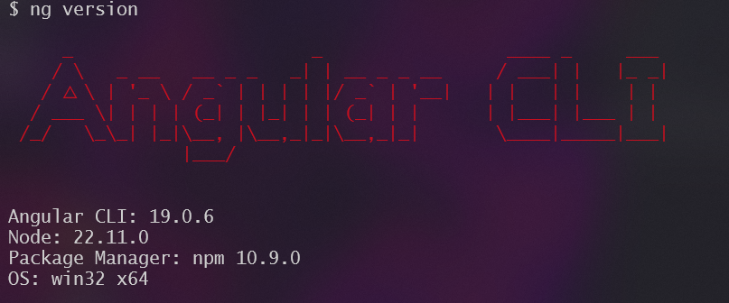

# Database Scaling

Digamos que estás creando una aplicación que necesita almacenar **información del usuario** .

Cuando su aplicación tiene unos cientos de usuarios, puede mantener todos los datos en un servidor de base de datos.

Pero a medida que su aplicación crece y obtiene más usuarios, necesita almacenar **más datos** .

Si no escala su base de datos para manejar el aumento de carga, puede **ralentizar** su aplicación y causar problemas.

En este artículo exploraremos **8 estrategias** para escalar bases de datos para garantizar que su aplicación siga funcionando con un rendimiento óptimo sin que la base de datos se convierta en un cuello de botella.

## **1. Escalado vertical**

<figure><figcaption></figcaption></figure>

El escalamiento vertical implica agregar más recursos (CPU, RAM, almacenamiento) a un solo servidor de base de datos.

Es una solución rápida y sencilla cuando tienes una **base de datos más pequeña** , pero tiene limitaciones.

Puede resultar **costoso** y hay un límite en cuanto a lo que se puede ampliar.

Además, el escalamiento vertical introduce un **único punto de falla** , ya que todos los huevos están en una sola canasta.

> **Ejemplo:** Un pequeño sitio web de comercio electrónico experimenta un aumento de tráfico durante las rebajas navideñas. Escalan verticalmente su servidor de base de datos añadiendo más RAM para gestionar la carga adicional.

## **2. Indexación**

Los índices al final de un libro le ayudan a encontrar rápidamente información específica sin tener que revisar cada página.

De la misma manera, **los índices de bases de datos** ayudan a encontrar datos mucho más rápido sin tener que escanear cada fila de una tabla.

Los índices generalmente se crean en **las columnas más consultadas** para que las solicitudes de lectura sean más rápidas, pero la indexación excesiva puede ralentizar el rendimiento de escritura debido a la sobrecarga.

## **3. Fragmentación**

Una sola máquina solo puede almacenar una cierta cantidad de datos.

Se quedará sin espacio y se ralentizará a medida que más personas empiecen a usar su aplicación.

Para evitar esto, puedes dividir los datos en **fragmentos más pequeños (fragmentos)** y almacenarlos en diferentes servidores.

Este proceso se llama **fragmentación de base de datos.**

<figure><figcaption></figcaption></figure>

Distribuir datos de esta manera hace que sea más fácil escalar y manejar más usuarios.

## **4. Particiones verticales**

En situaciones donde se accede a algunas columnas con más frecuencia que a otras, es una buena idea dividir la tabla de base de datos en tablas más pequeñas, cada una de las cuales contenga un subconjunto de las columnas de la tabla original.

Esto ayuda a reducir la cantidad de datos leídos durante las consultas y puede mejorar el rendimiento para patrones de acceso específicos.

> **Ejemplo:** Una aplicación de comercio electrónico podría dividir su `product`tabla en:
>
> * Una `"core_product"`tabla con datos de acceso frecuente (ID, nombre, precio, categoría)
> * Una `"product_details"`tabla con datos a los que se accede con menos frecuencia (descripción, especificaciones)
> * Una `"product_media"`tabla con grandes datos binarios (imágenes, vídeos)

***

## **5. Almacenamiento en caché**

En casi todas las aplicaciones importantes, se accede a algunos datos con más frecuencia que a otros.

Por ejemplo:

* En una aplicación de blogs, algunos artículos se leen con más frecuencia que otros.
* En una aplicación de redes sociales, algunos usuarios utilizan la plataforma con más frecuencia que otros.
* En una plataforma de streaming, algunas películas se ven con más frecuencia que otras.

Es inteligente almacenar estos datos a los que se accede con frecuencia en una **capa de almacenamiento más rápida** para acelerar el acceso y reducir la carga en la base de datos.

<figure><figcaption></figcaption></figure>

Esto se conoce como **almacenamiento en caché** y es una opción popular para acelerar las consultas de datos a los que se accede con frecuencia.

## **6. Replicación**

Si sus servidores de base de datos solo están ubicados en una región, los usuarios de otras regiones pueden experimentar una mayor latencia.

Para solucionar esto, podemos replicar la base de datos principal en otras regiones y manejar **las solicitudes de lectura** localmente.

Este proceso se llama **replicación de base de datos.**

En pocas palabras, la replicación de bases de datos implica crear y mantener múltiples copias (réplicas) de una base de datos en diferentes servidores o ubicaciones para mejorar el rendimiento de lectura, garantizar una alta disponibilidad y la recuperación ante desastres.

Estas réplicas se sincronizan con la base de datos original (la primaria), lo que garantiza la consistencia de los datos.

<figure><figcaption></figcaption></figure>

**Tipos de replicación** :

1. **Replicación síncrona:** Los cambios realizados en la base de datos principal se replican inmediatamente a todas las réplicas antes de que la transacción se considere completa. Esto garantiza una alta consistencia de los datos, pero puede afectar el rendimiento debido a la sobrecarga adicional.
2. **Replicación asincrónica:** Los cambios en la base de datos principal se replican en las réplicas con un ligero retraso. Esto ofrece un mejor rendimiento, pero implica la posibilidad de inconsistencias en los datos entre la base de datos principal y las réplicas (lo que se conoce como retraso de replicación).

## **7. Vistas materializadas**

Algunas consultas de bases de datos son complejas y pueden tardar mucho tiempo en ejecutarse.

Esto puede ralentizar el rendimiento de la aplicación si estas consultas se ejecutan con frecuencia.

Pero, ¿qué pasa si precalculamos y almacenamos los resultados de estas consultas complejas y frecuentes?

Ésta es la idea detrás de **las Vistas Materializadas.**

Las vistas materializadas son conjuntos de resultados de consultas complejas **almacenados en disco y previamente calculados .**

A diferencia de las vistas regulares, que son virtuales y se calculan sobre la marcha, las vistas materializadas almacenan físicamente los resultados, lo que los hace fácilmente disponibles para una rápida recuperación.

Mejora significativamente el rendimiento de las consultas para operaciones **complejas** y **que requieren muchos recursos .**

**Ejemplo:**

> Una plataforma de comercio electrónico necesita generar informes diarios de ventas que agreguen datos de ventas por **fecha** y **producto** . El equipo directivo consulta estos informes con frecuencia para tomar decisiones comerciales.

**Crear vista materializada:**

<pre class="language-sql"><code class="lang-sql"><strong>CREATE MATERIALIZED VIEW daily_sales_summary
</strong>AS
SELECT date, product_id, SUM(quantity) AS total_quantity, SUM(amount) AS total_amount
FROM sales
GROUP BY date, product_id;
</code></pre>

**Actualización de programación:**

<pre class="language-sql"><code class="lang-sql"><strong>CREATE OR REPLACE SCHEDULE job_refresh_sales_summary
</strong>ON SCHEDULE EVERY 1 DAY STARTS '2024-07-03 00:00:00'
DO
  REFRESH MATERIALIZED VIEW daily_sales_summary;
</code></pre>

## **8. Desnormalización de datos**

Algunas consultas de bases de datos pueden involucrar **múltiples tablas** y **uniones complejas** .

Estas consultas suelen ser lentas y pueden hacer que la aplicación sea más lenta para tablas grandes.

Para evitar esto, podemos agregar redundancia combinando **varias tablas en una** para reducir la necesidad de uniones complejas.

Esto se llama **desnormalización de datos.**

Es el proceso de introducir intencionalmente redundancia en una base de datos para optimizar el rendimiento de lectura combinando tablas o agregando datos redundantes.

**Ejemplo:**

> Una plataforma de redes sociales tiene un esquema de base de datos normalizado con tablas separadas para **usuarios** , **publicaciones** , **comentarios** y **me gusta** .

**Esquema normalizado:**

<pre class="language-sql"><code class="lang-sql"><strong>CREATE TABLE users (
</strong>    user_id INT PRIMARY KEY,
    username VARCHAR(100),
    email VARCHAR(100)
);

<strong>CREATE TABLE posts (
</strong>    post_id INT PRIMARY KEY,
    user_id INT,
    content TEXT,
    created_at TIMESTAMP,
    FOREIGN KEY (user_id) REFERENCES users(user_id)
);

<strong>CREATE TABLE comments (
</strong>    comment_id INT PRIMARY KEY,
    post_id INT,
    user_id INT,
    comment TEXT,
    created_at TIMESTAMP,
    FOREIGN KEY (post_id) REFERENCES posts(post_id),
    FOREIGN KEY (user_id) REFERENCES users(user_id)
);
</code></pre>

La plataforma experimenta un alto tráfico de lectura para los perfiles de usuario y sus publicaciones y comentarios asociados, por lo que almacena las publicaciones y los comentarios como matrices JSON dentro de la `user_profiles`tabla.

**Esquema desnormalizado:**

```sql
CREATE TABLE user_profiles (
    user_id INT PRIMARY KEY,
    username VARCHAR(100),
    email VARCHAR(100),
    posts JSON,
    comments JSON
);
```

Cada una de estas estrategias tiene sus propias desventajas en términos de complejidad, consistencia y rendimiento.

El mejor enfoque a menudo implica una combinación de estas técnicas, adaptadas a las necesidades y limitaciones específicas de su aplicación.
