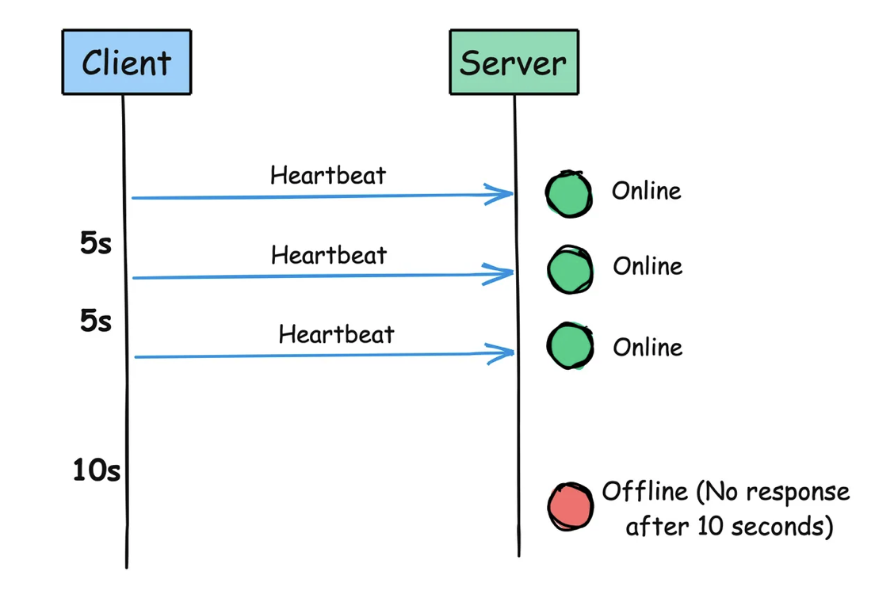

# HeartBeats: Cómo los sistemas distribuidos se manten vivos

En un sistema distribuido, **las cosas fallan.**

Mal funcionamiento del hardware, fallos de software o caída de las conexiones de red.

Ya sea que esté viendo su programa favorito en línea, haciendo una compra en línea o revisando su saldo bancario, está confiando en una compleja red de servicios interconectados.

Pero, ¿cómo sabemos si un servicio en particular está vivo y funcionando como se espera?

Aquí es donde **los Heartbeats entran** en juego.

<figure><figcaption></figcaption></figure>

En este artículo, aprenderemos sobre qué son los latidos cardíacos, por qué son importantes, cómo funcionan y ejemplos del mundo real en los que se utilizan.

## **¿Qué es exactamente un Heartbeats?**

> En los sistemas distribuidos, un latido del corazón es un mensaje periódico enviado de un componente a otro para monitorear la salud y el estado del otro.

Su propósito principal es señalar: **"¡Oye, todavía estoy aquí y trabajando!"**

Esta señal suele ser un pequeño paquete de datos transmitidos a intervalos regulares, que suelen oscilar entre segundos y minutos, dependiendo de los requisitos del sistema.

<figure><figcaption></figcaption></figure>

## **¿Por qué Nnecesitamos Heartbeats?**

Sin un mecanismo de latido del corazón, es difícil detectar rápidamente fallas en un sistema distribuido, lo que lleva a:

* Detección y recuperación de fallas retrasadas
* Aumento del tiempo de inactividad y errores
* Disminución de la fiabilidad general del sistema

Los latidos del corazón pueden ayudar con:

* **Monitoreo**: Los mensajes de Heartbeat ayudan a monitorear la salud y el estado de diferentes partes de un sistema distribuido.
* **Detección de fallos: los** latidos cardíacos permiten que un sistema identifique cuándo un componente deja de responder. Si un nodo pierde varios latidos esperados, es una señal de que algo podría estar mal.
* **Activación de acciones de recuperación:** los latidos cardíacos permiten al sistema tomar medidas correctivas. Esto podría significar mover las tareas a un nodo sano, reiniciar un componente fallido o hacer saber a un administrador del sistema que necesita intervenir.
* **Equilibrio de carga**: Al monitorear los latidos del corazón de diferentes nodos, un equilibrador de carga puede distribuir tareas de manera más efectiva a través de la red en función de la capacidad de respuesta y la salud de cada nodo.

## **¿Cómo funcionan los Heartbeats?**

El mecanismo del latido del corazón involucra dos componentes principales:

1. **Heartbeat sender (nodo):** Este es el nodo que envía señales periódicas de latidos cardíacos.
2. **Heartbeat receiver (Monitor):** Este componente recibe y monitorea las señales de los latidos del corazón.

Aquí hay una descripción general simplificada del proceso:

1. El **nodo** envía una señal de latido al **monitor** a intervalos regulares (por ejemplo, cada 30 segundos).
2. El monitor recibe la señal de latido y actualiza el estado del nodo como **"vivo"** o **"disponible".**
3. Si el monitor no recibe una señal de latido del corazón dentro del plazo esperado, marca el nodo como **"no disponible"** o **"fallido".**
4. El sistema puede entonces tomar las medidas apropiadas, como redirigir el tráfico, iniciar procedimientos de conmutación por error o alertar a los administradores.

<figure><figcaption></figcaption></figure>

Aunque conceptualmente simple, la implementación del latido del corazón tiene algunos matices:

* **Frecuencia:** ¿Con qué frecuencia se deben enviar los latidos del corazón? Tiene que haber un equilibrio. Si se envían con demasiada frecuencia, utilizarán demasiados recursos de red. Si se envían con poca frecuencia, podría llevar más tiempo detectar problemas.
* **Tiempo de espera:** ¿Cuánto tiempo debe esperar un nodo antes de considerar otro nodo "muerto"? Esto depende de la latencia de red esperada y de las necesidades de la aplicación. Si es demasiado rápido, podría confundir un nodo vivo con uno muerto, y si es demasiado lento, podría tardar más en recuperarse de los problemas.
* **Carga útil:** Los latidos cardíacos generalmente solo contienen un poco de información, como una marca de tiempo o un número de secuencia. Pero también pueden llevar datos adicionales como la cantidad de carga que un nodo está manejando actualmente, métricas de salud o información de versión.

**Tipos de Heartbeats**

Hay dos tipos principales de latidos cardíacos:

1. **Push heartbeats**: los nodos envían activamente señales de latidos al monitor.
2. **Pull heartbeats**: El monitor consulta periódicamente los nodos por su estado.

### **Desafíos y consideraciones**

Si bien los latidos del corazón son una parte fundamental para mantener la integridad del sistema, no están exentos de desafíos:

* **Network Congestion**: Si no se gestiona correctamente, el flujo constante de señales de latido del corazón puede contribuir a la congestión de la red.
* **False Positives**: Los intervalos de latido del corazón mal configurados podrían provocar falsos positivos en la detección de fallos, donde un componente lento pero funcional se identifica incorrectamente como fallido.
* **Resource Usage**: El monitoreo continuo requiere recursos computacionales, que deben optimizarse para evitar una tensión indebida en el sistema.
* **Split-Brain Scenarios:** En algunos casos raros, un fallo de red puede particionar un sistema, y ambas partes pueden declarar al otro muerto. Esto requiere mecanismos de manejo de fallos más sofisticados.

### **Heartbeats en acción: ejemplos del mundo real**

* **Réplica de base de datos:** Las bases de datos primarias y de réplica a menudo intercambian latidos para garantizar que los datos estén sincronizados y para activar la conmutación por error si la principal deja de responder.
* **Kubernetes:** En la plataforma de orquestación de contenedores Kubernetes, cada nodo envía latidos cardíacos regulares al plano de control para indicar su disponibilidad. El plano de control utiliza estos latidos para rastrear el estado de los nodos y tomar decisiones de programación en consecuencia.
* **Elasticsearch:** En un clúster Elasticsearch, los nodos intercambian latidos para formar una red de chismes. Esta red permite que los nodos se descubran entre sí, compartan información del estado del clúster y detecten fallas de los nodos.

Los latidos del corazón son los pulsos invisibles que mantienen vivos y bien coordinados los sistemas distribuidos.

Así que, la próxima vez que se encuentre con un sistema distribuido, tómese un momento para apreciar los guardianes silenciosos, the heartbeats, que trabajan incansablemente para mantener el pulso del sistema estable y fuerte.

